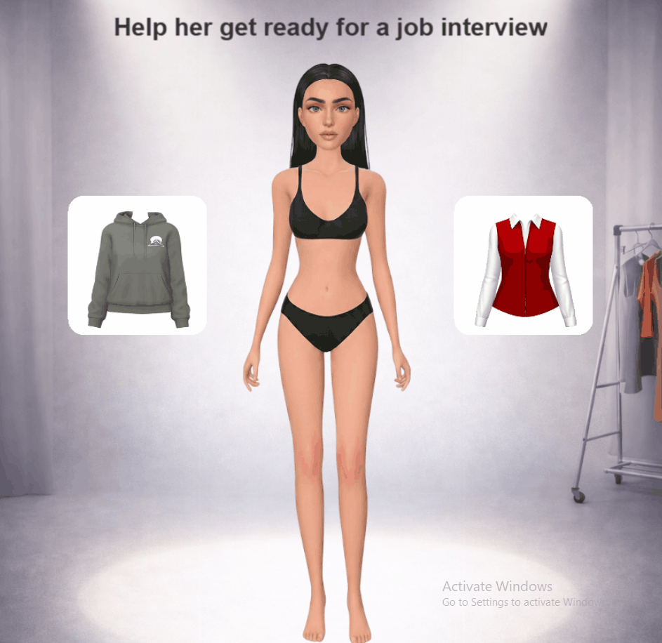
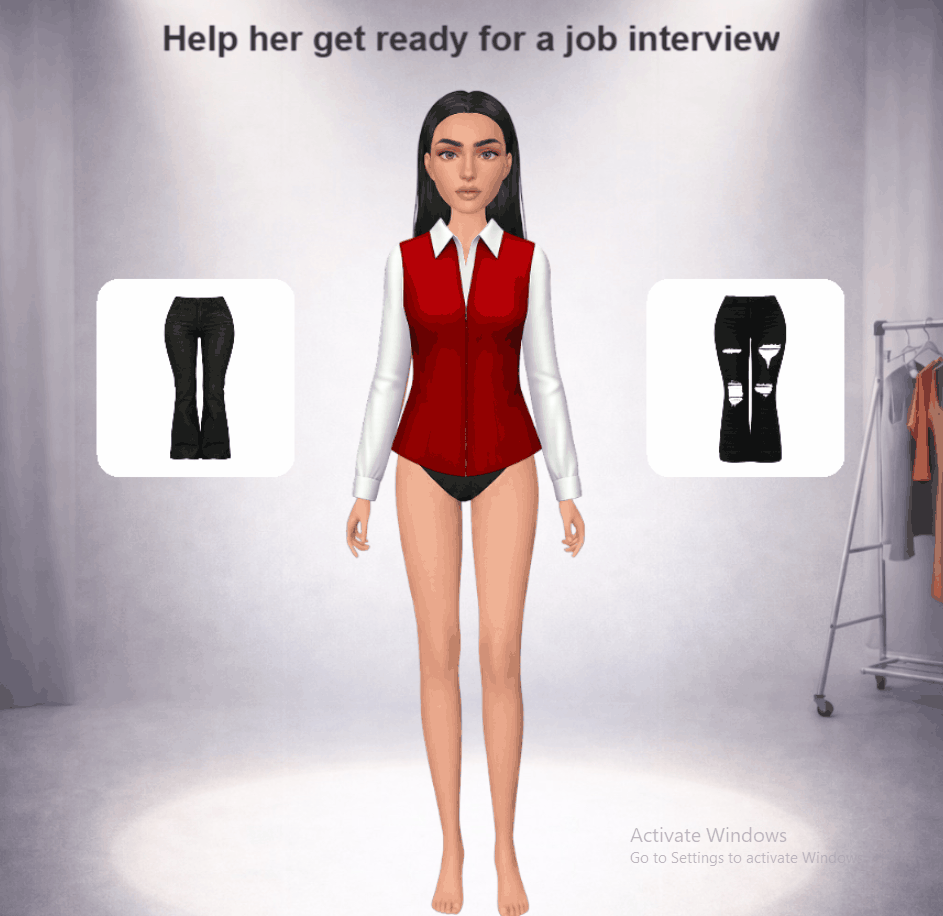
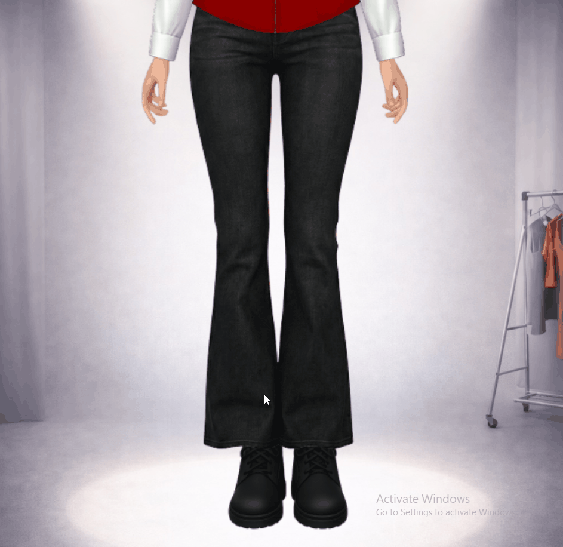
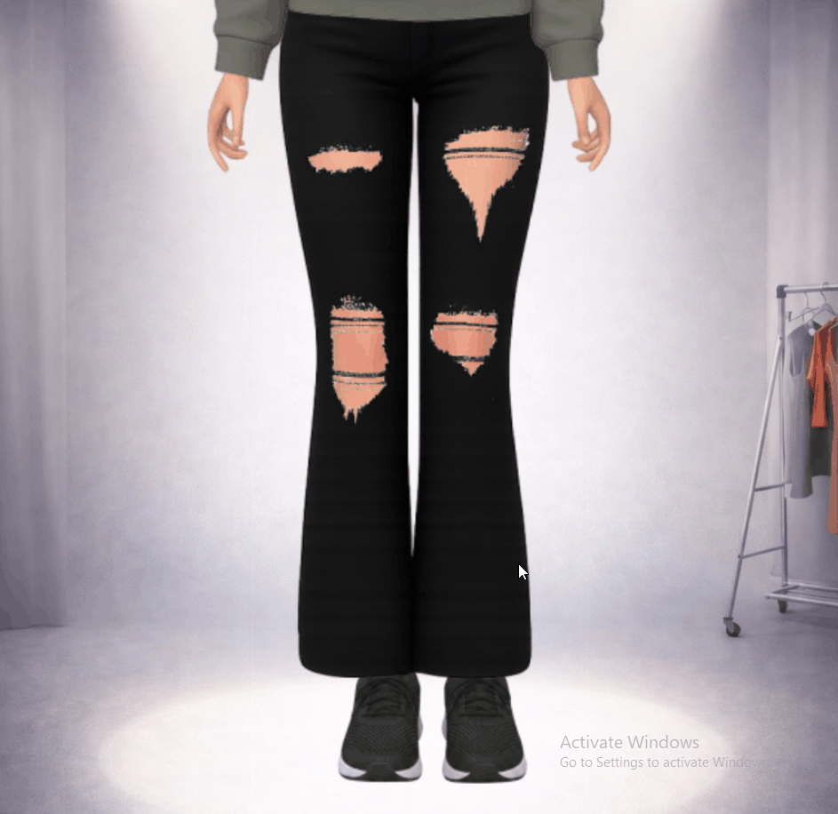

# 🎮 Playable Ad Prototype

This project is a **playable ad prototype** built using **PixiJS**, designed to simulate an interactive dress-up experience.

---

## Overview

The user can drag and drop clothing items onto a character, progressing through multiple stages:

- 👕 Top  
- 👖 Pants  
- 💇‍♀️ Hair  
- 👢 Shoes  

Based on the choices, the character reacts with different facial expressions, and a final outcome is displayed.

---

## Preview

### Happy Reaction


### Sad Reaction


### 🔍 Zoom Transition


### Good Ending


### Bad Ending


---

## Assets & Design

All visual assets used in this project are **AI-generated**.

After generation, assets were:
- Carefully **refined and positioned in Figma**
- Structured for proper **layering and alignment**
- Optimized for integration into PixiJS

---

## Game Logic

To achieve a **successful (good) outcome**, the user must select the correct item in **every stage**:

- 👕 Top (blouse)  
- 👖 Pants  
- 💇‍♀️ Hair  
- 👢 Shoes (boots vs sneakers)  

If any incorrect choice is made, the final result will be a **bad outcome**.

---

## Features

- Drag & drop outfit selection  
- Layer-based character customization  
- Dynamic facial expressions (correct / wrong choices)  
- Smooth zoom transitions between stages  
- Animated final feedback (win / fail stamp)  

---

## Tech Stack

- **PixiJS** – rendering & interaction  
- **JavaScript (ES Modules)**  
- **Vite** – development server  

---

## ⚙️ Run the Project

```bash
npx vite
